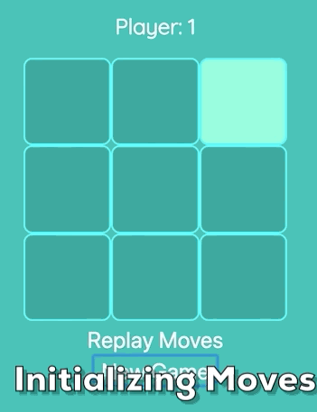

# Tic Tac Toe
## A Tic Tac Toe game made in HTML/CSS/JS.

### Features:
* Cyan Color Theme: Easy on the eyes
* Win/Loss/Tie Game Logic
* Keeps track of current player
* Declares winner and disables game upon win
* Reset Button
* Replay the order of moves live to see what the last move played was or how you lost.

### Implementation 

Demonstration of the replay

Three key features of this game

* Win Logic implementation
* Tie implementation
* Replay implementation 

**BEWARE MATH BELOW**

1. 
**Win Logic**
  * The win logic was implemented using a 2-d array with sizes 3 x 3. To represent an unselected tile, it is denoted with a `0`. Player one's move is denoted with `1` and player two's move is denoted with `2`. 
   * To check for a win, the `isWin` algorithm checks every single possible sum of every row, column, diagonal, and anti-diagonal when ever a tile is played. 

  *  If the sum of any row, column, diagonal, or  anti-diagonal is `3` or `-3` a player has just played the winning move and the `win` boolean is set to `true`

  * **Issues** - Because the game board is set to a size of 3 x 3 time is not an issue. However it is important to note that the `isWin` has a worst case time complexity of O(2N² + 2/3N).
This is because every move every time a tile is placed we check every single possible row sum and column sum which has a respective time complexity of O(N²). Checking for diagonal and anti-diagonal is trivial with a time complexity of O(1/3N).

  * Scaling this design to a board of 10 x 10 or 25 x 25 would demand a redesign of the algorithm.

2. 
**Tie Logic**
  * The tie logic was implemented using a hash map. At the start of every new game, a hash map is created with a single key of `0` with a value of `9`. 

  * On every successful placement of a tile by either player, the value of `0` is decreased by 1.
  * If the game ends and `0` has a value of 0 and `win` is still false, we know that the all possible squares have been played and that there is no winner, therefore indicating a tie.

3.  
**Replay Logic**
  * The replay was implemented using a 3-d array. Every time a player was successful in playing a move, we create a deep copy  of the board's state at that time and push it into a new array that stores all previous board states.

  * A `renderBoard` function was created to help decrease repeated code. Whenever the function `replay` is called, it will begin printing each board state out to the board.
  * To give it the iterative feeling, we set a `timeOut` function at every boardState during the loop, before calling `renderBoard`.

## Future Updates (Not in order)
1. Give user option to change color scheme of game from muted cyan to something else. 

2. Score board which will keep track of Player 1 and Player 2 wins.

3. Blinking animations for when a winning combination is found.

